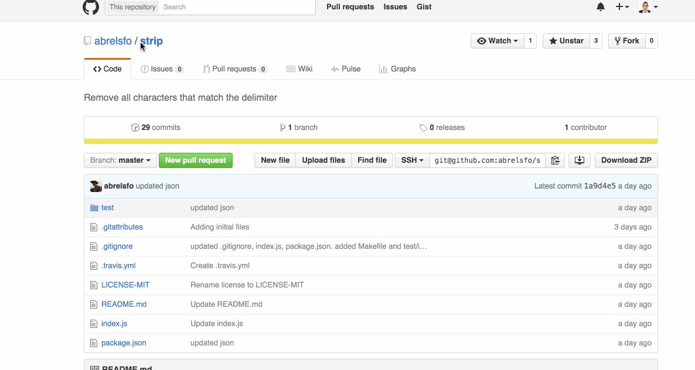

# sist
[](https://www.npmjs.com/package/sist)
[](https://travis-ci.org/dawsonbotsford/sist)
[](http://npmjs.org/sist)
[](https://github.com/sindresorhus/xo)

> cli to print system information in markdown format

<br>

## Demo



<br>

## Install

```
$ npm install -g sist
```

<br>

## Usage
```
$ sist

### shell  
`uname`: Darwin
`echo $SHELL`: /bin/zsh
`echo $TERM`: xterm-256color
`echo $TERM_PROGRAM`: iTerm.app

### node  
`npm -v`: 3.6.0
`node --version`: v5.6.0

Time created: Mon Feb 29 2016 00:14:54 GMT-0500 (EST)

```

<br>

---
Sist outputs markdown. This means that it gets parsed beautifully in GitHub **issues**, **pull requests**, and **wiki's**.

### shell  
`uname`: Darwin  
`echo $SHELL`: /bin/zsh  
`echo $TERM`: xterm-256color  
`echo $TERM_PROGRAM`: iTerm.app  

### node  
`npm -v`: 3.6.0  
`node --version`: v5.6.0  

Time created: Mon Feb 29 2016 00:14:54 GMT-0500 (EST)

<br>

---
Tell your users to create issues using sist by placing information in [.github/issue_template.md](.github/issue_template.md)

<br>

## More help
```
$ sist --help

  Usage
    sist

  Examples
    $ sist

      ### shell  
      `uname`: Darwin  
      `echo $SHELL`: /bin/zsh  
      `echo $TERM`: xterm-256color  
      `echo $TERM_PROGRAM`: iTerm.app  

      ### node  
      `npm -v`: 3.6.0  
      `node --version`: v5.6.0  

      Time created: Mon Feb 29 2016 00:14:54 GMT-0500 (EST)
```

<br>

## License

MIT © [Dawson Botsford](http://dawsonbotsford.com)

<br>

---
If you like this, star it. If you want to follow me, follow me.
